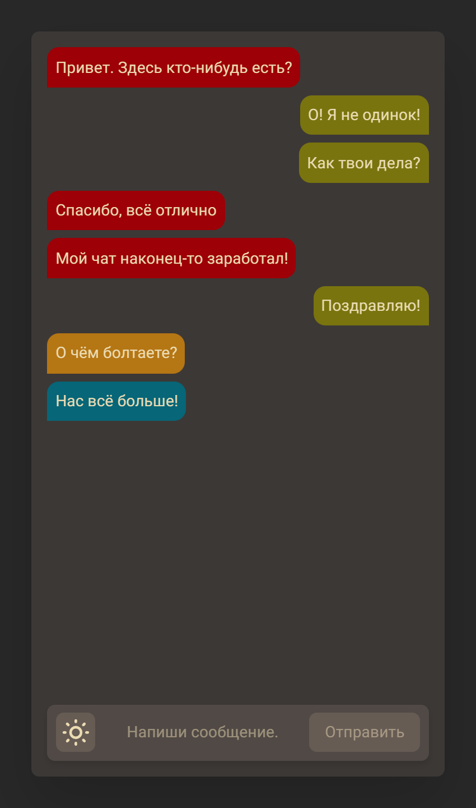
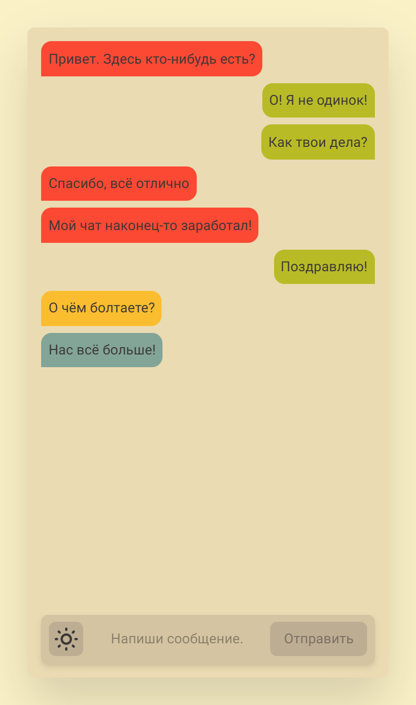

# Chat
> **Chat** - это анонимный асинхронный мессенджер

**Chat** написан *за 10 часов* как тестовое задание перед одним из моих собеседований. Я выполнял [это техническое задание](./Техническое%20задание.md)

## Стек
- Frontend:
  - [TypeScript](https://www.typescriptlang.org)
  - [React](https://react.dev) 19
  - [Next.js](https://nextjs.org) 15 (App Router)
  - [Tailwind CSS](https://tailwindcss.com/)
  - [Yup](https://github.com/jquense/yup)
  - [SWR](https://swr.vercel.app/ru)
- Backend:
  - [TypeScript](https://www.typescriptlang.org)
  - [Nest](https://nestjs.com) 11
  - [TypeORM](https://typeorm.io)
  - [Swagger UI](https://swagger.io) Express
- Database: [PostgreSQL](https://www.postgresql.org)

## О проекте
- Анонимный асинхронный чат на основе WebSockets
- Цветовое выделение разных пользователей
- Адаптивная верстка. Корректное отображение на мобильных устройствах, планшетах, ноутбуках, десктопах
- SSR ([Server-Side Rendering](https://nextjs.org/docs/pages/building-your-application/rendering/server-side-rendering))
- Валидация данных с помощью [Yup](https://github.com/jquense/yup)
- Структура проекта в соответствии с [Feature-Sliced Design](https://feature-sliced.design)
- Цветовая схема [Gruvbox](https://github.com/morhetz/gruvbox). Возможность переключения тёмной и светлой темы
- Запуск с помощью Docker контейнеров (используется Docker Compose)

## Скриншоты
|||
|-|-|

## Запуск
### Development
Database: 

    docker compose -f 'docker-compose.yml' up -d --build 

Backend:

    cd ./backend
    npm install
    npm run start:dev

Frontend:

    cd ./frontend
    npm install
    npm run dev

### Production

    docker compose -f 'docker-compose-all.yml' up -d --build 
